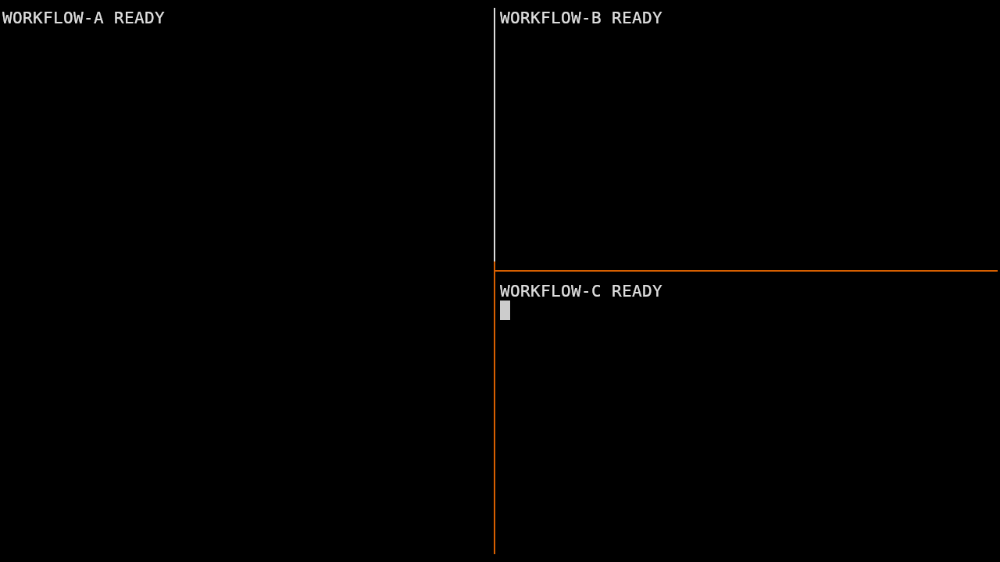

# Tiled frame-toggle evidence, 2026-09-06

Full Zellij parity remains false. This slice completes the interrupted ordinary
tiled frame toggle, using generic public owner geometry contributions and Lisp
policy. The underlying geometry contribution code was already in `1736077`;
its fresh Nix build failed an outer/content rectangle assertion. The first
repair exposed a multi-field duplicate-key validator bug. Both are corrected.
The retained failure logs and `failed-first` case document these failures.

The original boundary helper also used a nonexistent pane `:focus` field,
bold frame styling for non-bold boundaries, and incomplete junction glyphs.
The Lisp helper now uses public focus/mode and viewport inputs, combines
neighboring edges, and chooses shared-boundary color. Before that correction,
80×24 frame-off stages differed in 78 modeled cells. They now differ in 14,
all retained application content from the pre-existing startup discrepancy.
`pre-boundary-fix` retains the earlier exact cells and raw output.

The `z` binding now belongs to the frame component, so removing that component
also removes its binding. Previously reload rejected its dangling command
reference; the failing lifecycle log is retained.

## Measured checks

- `nix flake check -L path:.` passed after updating the existing mode test for
  the additive geometry inspector fields. All 22 checks pass, including 13
  paired workflow scenarios. The first failing full-check log is retained.
- `checks.pane-frames` runs regular and bare real-daemon tests: on/off/on, one
  WINCH per child per toggle, unchanged outer rectangles and PIDs, preserved
  geometry/state through successful/failed reload and detach, and reversal
  on owner removal. At 120×40 the exact child rows×cols change from
  `38×58 / 18×58 / 18×58` to `40×59 / 19×60 / 20×60`.
- Paired frame-toggle runs at [80×24](80x24/summary.json) and
  [20×8](20x8/summary.json) pass settled input deltas, focus, full FIRST/WINCH
  cell-dimension histories, and outer ioctl equality. Full input/cell parity
  remains false. The small run retains 43–51 tiled differing cells and 15
  fullscreen cells, with cursor differences.
- [Base graphical capture](visual/summary.json): 14 settled checkpoints have
  zero differing pixels/cells at a 98×28 outer terminal, inside identical
  1280×720 Kitty windows. Startup differs in 50,698 pixels and 1,159 cells.
- [Finix patched-binary capture](finix-visual/summary.json): the same 14 settled
  checkpoints match exactly. Startup differs in 50,612 pixels and 1,159 cells.
  Initial child pixel metadata still differs; complete event histories remain
  in the reports. Equal settled screenshots do not normalize those histories.
- The isolated Finix flake checks regular/bare frame lifecycle and the packaged
  launcher in an 80×24 PTY, including private-runtime cleanup after stopping
  only the owned daemon. The package includes all existing live runtime patch
  hunks except the two geometry corrections already present in this source.

The graphical fixtures and PTY differential fixtures have different deterministic
workloads; each pair uses identical workloads, paths, environment, dimensions,
fonts and capabilities internally. Neither substitutes for the other. The
private graphical compositor cleanup reports retain zero owned processes after
capture. JSON/ANSI/log gzip files are lossless copies with no data normalization;
PNGs are unchanged. Existing pinned runner event comparison explicitly excludes
PID from one diagnostic comparison and retains raw observations.




## Reproduction and limits

```sh
nix run .#zellij-pane-workflow -- --only frame-toggle --output /tmp/frame-pair
nix run .#zellij-pane-workflow -- --only frame-toggle --cols 20 --rows 8 --output /tmp/frame-small
nix run .#zellij-pane-workflow -- --only frame-toggle --require-parity --output /tmp/frame-strict
```

The strict command still fails because complete coverage is false. The complete
surface remains in [the ledger](../../../zellij/surface.md). Stacked, floating,
borderless, grouped and multi-client frames, arbitrary junction layouts, startup
release notes/input/query ordering, default bars, tabs, layouts, plugins,
persistence, CLI and other pinned features remain required. This slice makes
no claim for those surfaces. The next bounded action is to extend session
mode routing and quit/detach behavior through public actions, retaining terminal
restoration and real-child lifecycle evidence.
