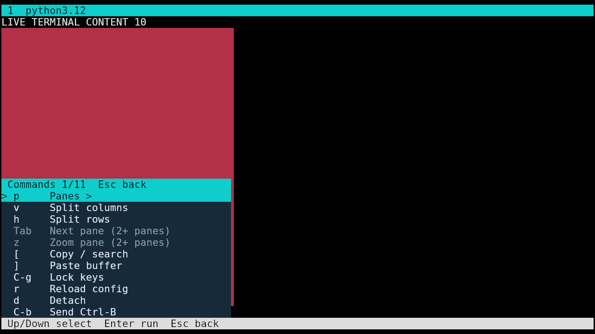

# Shared opaque-overlay and input capabilities

The previously separate Finix runtime changes are integrated as generic public
capabilities: opaque `:decorate` spans, pane-image crop subtraction, explicit
`:send-input`, and opt-in `:copy` keymap fallback. The existing custom Lisp menu
and optional Zellij profile can now use the same unpatched executable.
No live Finix configuration, live runtime patch, or running session was changed.

Base wire 11 accepts the previous 6–10 attachment versions; older viewers retain
their known features and can ignore additive fields. New overlay rendering needs
a capable viewer. All contributed text/geometry continues to belong to its Lisp
component and is clipped/validated by the shared runtime.

`nix flake check -L path:.` passes 24 checks, including 14 reference workflow
scenarios and regular/bare lifecycle checks. The unpatched Finix candidate passes
its existing menu integration plus frame, exit-text and disposable/retained
launcher tests. [Commands and runtime](checks.json) identify exact evidence.

The existing custom-menu graphical test also passes using the shared runtime:
300,000 native Kitty image pixels are visible normally and 164,150 with the
opaque command menu. Dismissal restores the original pixels exactly, live output
behind the menu remains hidden until dismissal, and lock/split UI checks pass.
The screenshots were captured on a private 1280×720 Kitty/Cage display.

The first copied graphical test failed because the pinned older Pillow lacks
`Image.get_flattened_data`. Only the copied test was adapted to `Image.getdata`;
its pixel predicates and screenshots are unchanged. The original failure and
capture are retained in `pillow-failure`, and the copied source is retained here.
The user's original test/configuration files were not edited.

This is prerequisite UI machinery, not a release-notes or floating-plugin
implementation. [Startup source findings](../../../zellij/startup-ui-investigation.md)
record the missing initialization, persistent state, pointer and floating UI
contracts. The full source ledger, startup input/size differences and all remaining
Zellij features still apply; full parity and coverage remain false.

The shared runtime also passed 14 settled frame-workflow screenshot and native Kitty text/cursor comparisons exactly. The initial startup screen still differs by 50,578 pixels and 1,159 modeled cells. See `frame-summary.json` and the unchanged PNGs and compressed raw reports in `frame-native/`; no normalization was applied.
